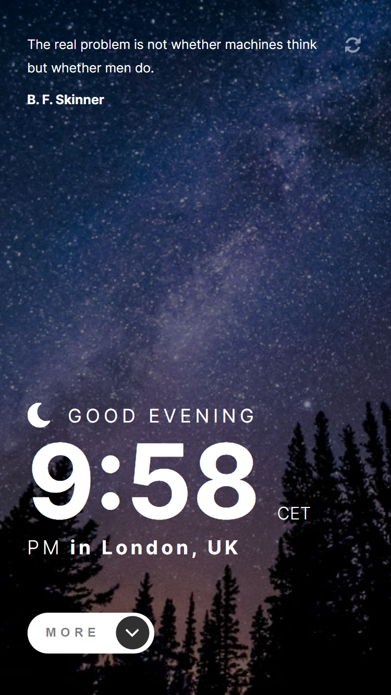

# Frontend Mentor - Clock app solution

Hello!

Thank you for taking your time to review my clock app project. This is a solution to the [Clock app challenge on Frontend Mentor](https://www.frontendmentor.io/challenges/clock-app-LMFaxFwrM).

## Table of contents

- [Overview](#overview)
- [Screenshots](#screenshot)
- [Built with](#built-with)

## Overview

This clock app can be used as a screen saver of a more complex application. It shows the user such information as :

- current time based on their timezone
- information about their location based on their IP addess and more specified time details (week number, weekday number and year day number)
- inspirational quote with a possibility to generate a different one

In addition to this, the entire application theme is depended on the current time - between 5AM and 6 PM the user will see a bright design with a daytime background image and after those hours, it will be automatically changed to a nighttime scenery.

## Screenshots

Mobile view:

Desktop view:

## Built with

- SCSS
- TypeScript,
- React.js
- React Toolkit (including thunks for async requests)
